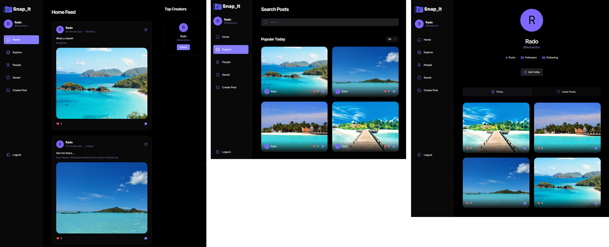

# Snap_It

## [Live Site](https://snap-it-app.vercel.app)

<br/>

## 📜 Description

Snap_It is a fun and interactive Instagram clone, that allows users to share and explore photos. It is developed using React.js, TypeScript, Zod, Tailwind CSS, shadcn/ui, React Hook Form, and a few more packages and libraries.

<br/>

## 🖼️ Screenshot



<br/>

## 🛠️ Built with:


<br/>

## 🚀 Quick start

Follow these steps to set up the project locally on your machine.

### *Prerequisites*

Make sure you have the following installed on your machine:
- [Git](https://git-scm.com)
- [Node.js](https://nodejs.org/en)
- [npm](https://www.npmjs.com)

#### _Cloning the Repository_

```
git clone https://github.com/rado-kolev/snap_it.git
cd brainwave
```

#### _Installation_

Install the project dependencies using npm:

```
npm install
```

#### _Running the Project_

```
npm run dev
```

#### _Follow the instructions_

Or open http://localhost:5173 in your browser to view the project.

